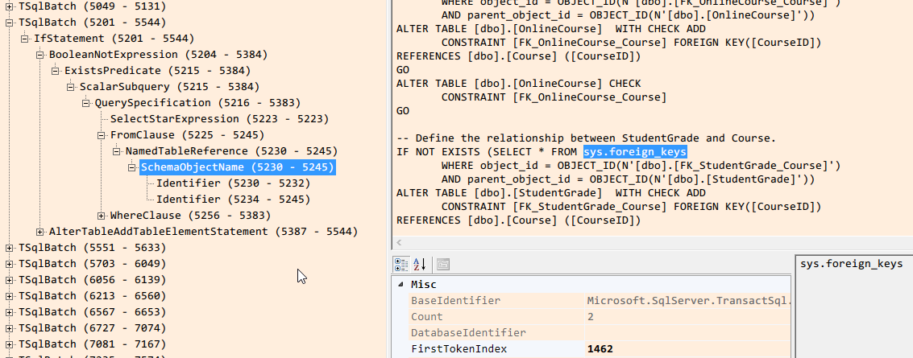

# TsqlScriptDom
A simple GUI tool to help use Microsoft.SqlServer.TransactSql.ScriptDom

I created this tool when I was learning on how to use the library to analyze T-SQL scripts. It basically contains a treeview to show the hierarchical structure of the SQL scripts, showing each fragment's properties, and generating formatted SQL scripts.

## Usage
 * You can pipe SQL scripts to the tool by using `"select * from foo" | TsqlScriptDom.exe -`
 * You can pass multiple SQL files to the tool from command line
 * You can drag & drop files onto the SQL script pane
 * You can open a new window by select some SQL scripts to parse them alone
 * Select a tree node will also select the corresponding SQL scripts in the editor
 * Double click a locationi in the editor, or use menu item "Tools/Locate in Tree" can locate the corresponding node in treeview
